Een Lichess schaakanalyse tool gebouwd met Astro. De applicatie haalt via de Lichess API de geanalyseerde schaakpartijen van een speler op en visualiseert de ratingontwikkeling over tijd als een interactieve grafiek. Gebruikers kunnen via twee sleepbare handles een tijdsperiode selecteren op de grafiek, waarna de applicatie de beste en slechtste partij op basis van accuraatheid binnen die periode naast elkaar toont, inclusief metadata zoals tegenstander, resultaat, rating en datum.

Het project combineert de volgende technologieën en API's:

Lichess API — content API voor het ophalen van schaakpartijen met accuraatheidsdata
Pointer Events API — voor de draggable range sliders op de grafiek
Web Share API — voor het delen van een game vergelijking
Clipboard API — voor het kopiëren van PGN notatie naar het klembord
Chart.js — voor de interactieve rating timeline visualisatie

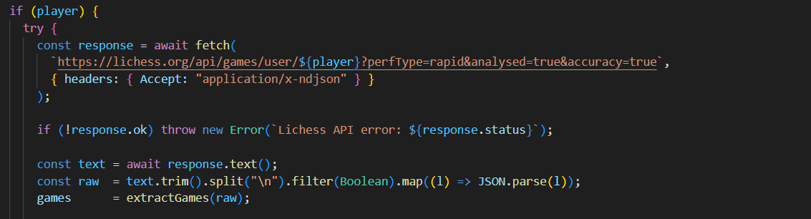
Lichess API integratie is gelukt. Het scheelt ook dat ik geen KEY nodig heb om toegang te krijgen. De fetch naar de Lichess API werkt nu correct met de parameters perfType=rapid, analysed=true en accuracy=true. De response komt binnen als NDJSON en wordt per regel geparsed naar een array van game-objecten.

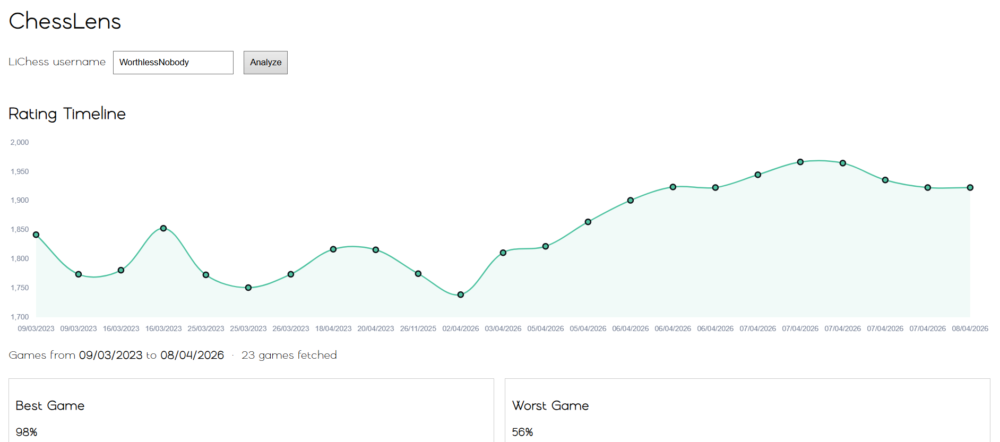
Rating timeline gebouwd. Chart.js rendert de volledige ratinggeschiedenis van een speler als een filled line chart. De grafiek toont alle geanalyseerde rapid games over tijd, met datum op de x-as en rating op de y-as.

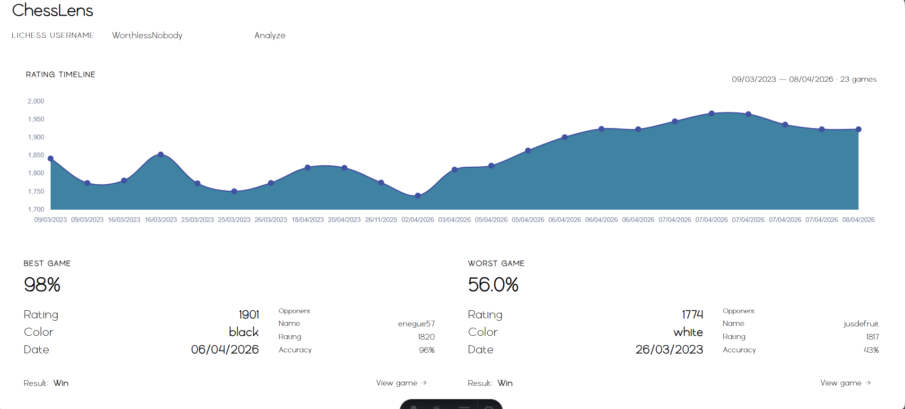
Best/worst game cards geïmplementeerd. Onder de grafiek worden twee kaarten naast elkaar getoond — de game met de hoogste accuracy en de game met de laagste accuracy. Per kaart is zichtbaar: accuracy percentage, rating, kleur, datum, tegenstander (naam, rating, accuracy) en het resultaat.

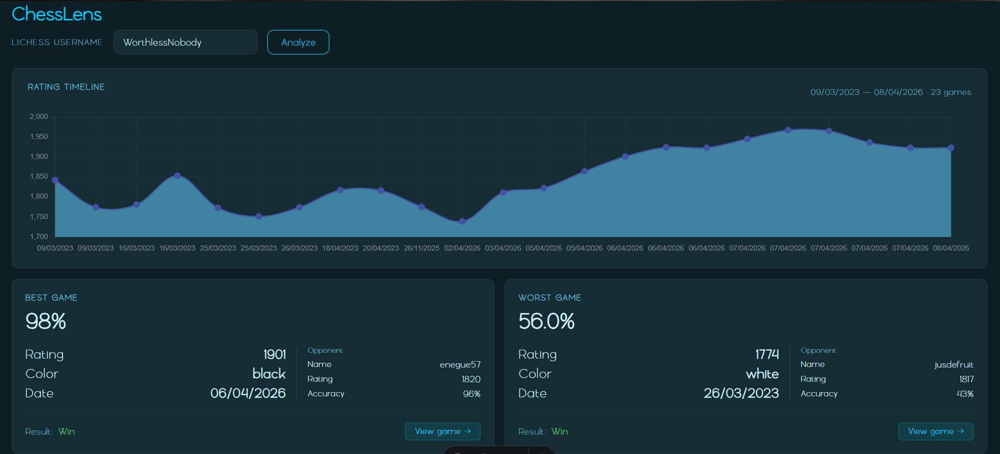
Dark theme toegepast. De UI is omgezet naar een donker kleurenschema met cyaan als primary accent, consistent door de hele pagina.

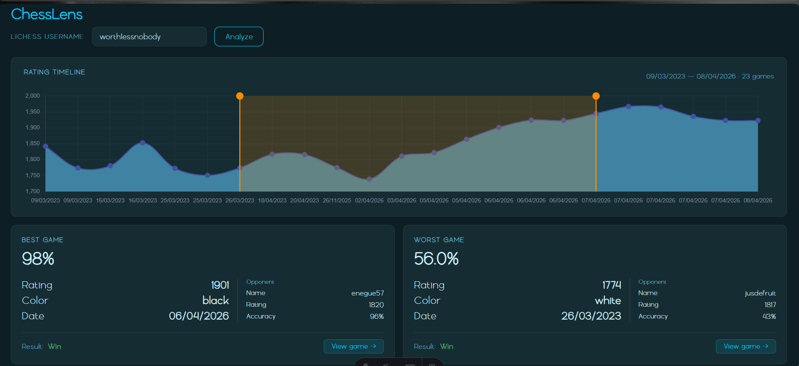
Draggable range sliders toegevoegd aan de grafiek. Twee sleepbare verticale lijnen op de Chart.js grafiek laten de gebruiker een tijdsperiode selecteren. Het geselecteerde gebied wordt visueel gehighlight. 

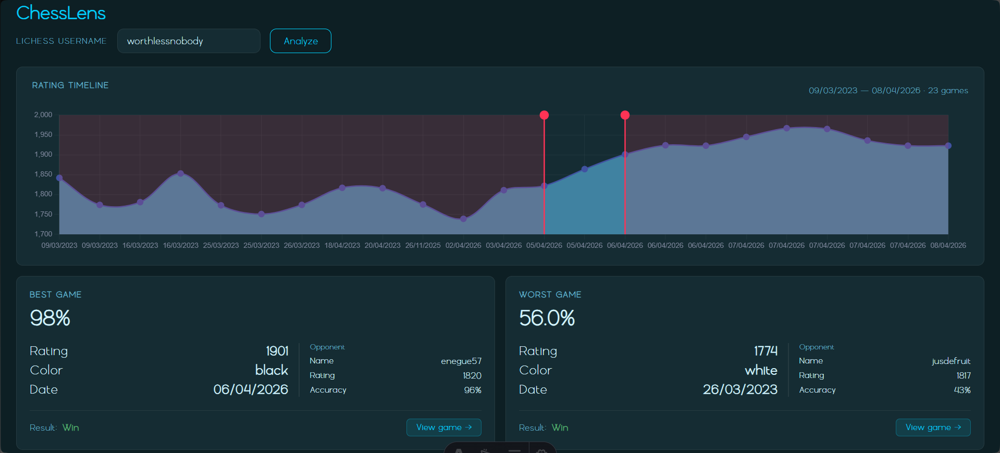
Wanneer de start handle voorbij de end handle wordt gesleept, inverteert de selectie en wordt alles buiten het bereik gehighlight in een andere kleur. Onder de grafiek toont een tekstlabel live de geselecteerde datumrange en het aantal games in die periode.

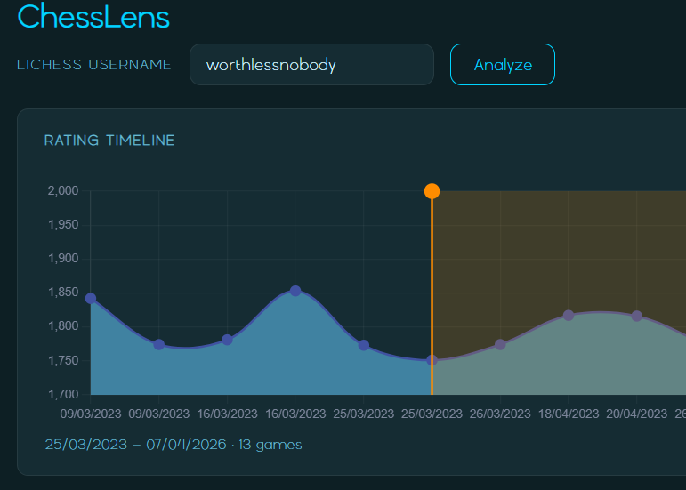
De geselecteerde tijd periode van de rating graph update nu live en vertelt ook hoeveel games er zijn binnen die params.  

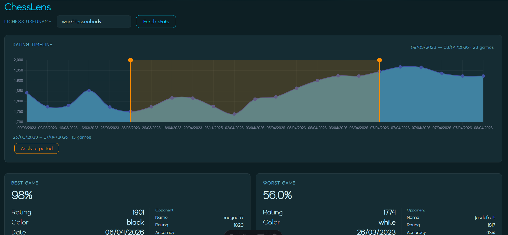
"Analyze period" knop geïmplementeerd. Na het selecteren van een range verschijnt een knop die de games filtert op de gekozen periode en de best en worst game daaruit toont in de kaarten.

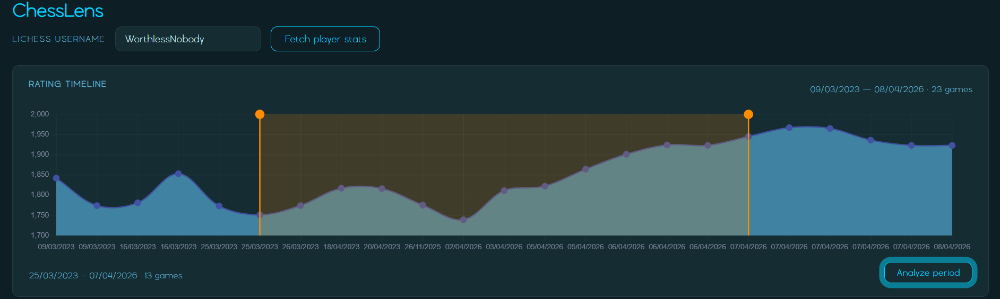

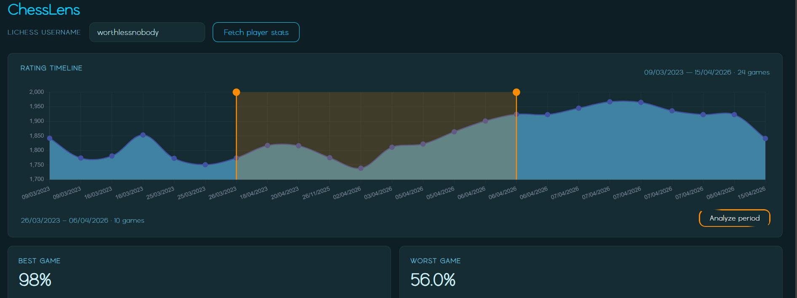

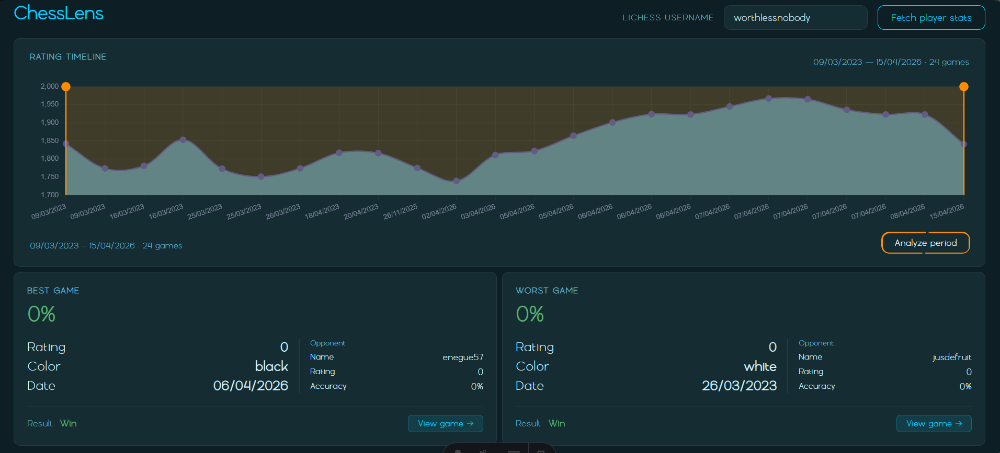